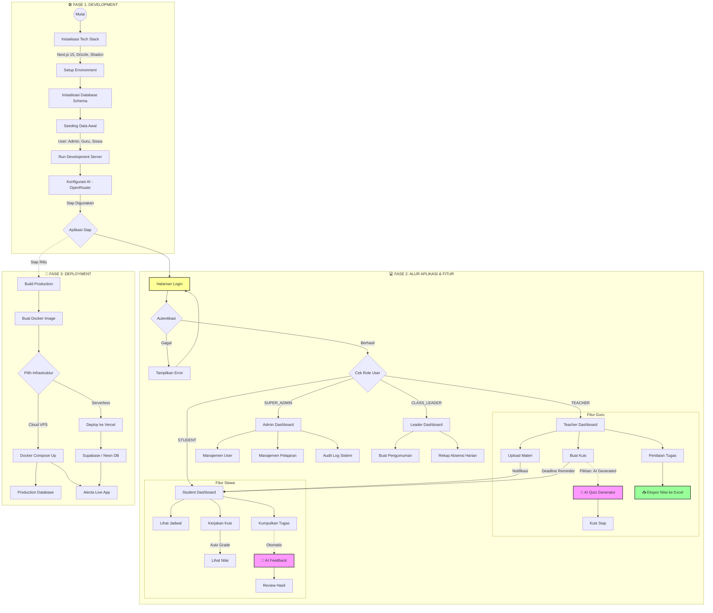

# 🎓 ALECTA - Smart School Management System

> **Platform Manajemen Sekolah Cerdas Berbasis AI dengan Sistem Terintegrasi**

Alecta adalah aplikasi web modern yang dirancang untuk mendigitalkan ekosistem sekolah secara menyeluruh. Dibangun dengan teknologi terkini, Alecta menghubungkan Siswa, Guru, Ketua Kelas, dan Administrator dalam satu platform yang efisien, transparan, dan cerdas.

---

## 🌟 Fitur Utama

### 🧠 Sistem AI Cerdas
- **AI Quiz Generator**: Guru dapat membuat kuis otomatis hanya dengan memasukkan topik.
- **AI Feedback**: Memberikan umpan balik otomatis pada tugas siswa untuk meningkatkan pemahaman.
- **Smart Analytics**: Analisis performa siswa dan kelas berbasis data.

### 👥 Peran & Akses Pengguna
1. **Siswa (Student)**
   - 📅 **Jadwal & Deadline**: Melihat jadwal pelajaran dan tenggat waktu tugas.
   - 📤 **Pengumpulan Tugas**: Upload tugas dan dapatkan feedback instan.
   - 📝 **Kuis Online**: Mengerjakan kuis dengan timer dan auto-grading.
   - 📊 **Progress Report**: Memantau nilai dan absensi sendiri.

2. **Ketua Kelas (Class Leader)**
   - 📢 **Pengumuman Kelas**: Membuat pengumuman untuk teman sekelas.
   - 📋 **Bantuan Absensi**: Membantu guru merekap kehadiran (opsional).
   - 🤝 **Penghubung**: Menjembatani komunikasi guru dan siswa.

3. **Guru (Teacher)**
   - 🏫 **Manajemen Kelas**: Mengatur materi, tugas, dan ujian.
   - 📥 **Sistem Penilaian**: Memberi nilai tugas dan kuis.
   - 📈 **Ekspor Excel**: Rekap nilai siap cetak/download dalam format Excel.
   - 🤖 **AI Assistant**: Membuat materi dan soal ujian dibantu AI.

4. **Super Admin**
   - 🛠️ **Manajemen Sistem**: Mengelola user, tahun ajaran, dan mata pelajaran.
   - 🔒 **Keamanan & Audit**: Memantau log aktivitas sistem.

---

## 🗺️ Roadmap & Alur Sistem

Berikut adalah alur lengkap sistem Alecta dari tahap pengembangan hingga deployment, beserta interaksi fitur di dalamnya.

---

## 🛠️ Teknologi & Pengaturan

### Tech Stack
- **Framework**: Next.js 15 (App Router)
- **Database**: PostgreSQL (via Supabase/Docker) & Drizzle ORM
- **Authentication**: Better Auth (Secure Email/Password)
- **UI/UX**: Tailwind CSS v4, Shadcn UI
- **AI Engine**: OpenRouter integration

### Konfigurasi Sistem
Sistem ini menggunakan konfigurasi berbasis file `.env` untuk keamanan maksimal.
- **Database URL**: Koneksi string ke PostgreSQL.
- **Auth Secret**: Kunci enkripsi untuk sesi login.
- **AI Keys**: API Key untuk fitur kecerdasan buatan.

---

## 📈 Skalabilitas & Masa Depan

Alecta dirancang untuk tumbuh bersama sekolah Anda. Arsitektur modular memungkinkan penambahan fitur di masa depan seperti:
- Integrasi Pembayaran SPP (Payment Gateway)
- Aplikasi Mobile (React Native)
- Perpustakaan Digital
- Pelacakan Bus Sekolah (GPS)

---

*Dibuat dengan ❤️ untuk Masa Depan Pendidikan Indonesia.*
